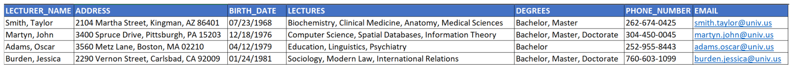

#AdvanceMankind 
======
##Data modeling (SQL) 

###Certain educational institution stores the information of its lecturers using a spreadsheet like the following: 

###Propose a relational model based on this data that complies with a third normal form (3FN) and implement it using the relational database of your choice (MySQL, SQL Server, DB2, Oracle). Your database tables should contain audit fields (creation date, last update date, etc.) and those must be updated according to the operations performed on them. 

 

##Relational model (Diagram generated using the software of your choice) – 20 pts. 

>Image on document. Peoples can to get that image from the SQL. With your prefer software for that.

------
##Database implementation (SQL file(s) used) – 10 pts. 
> Inside the node project (node folder too) called `lecturers.sql`

------
##Data handling (Node.js, Java) 

###Use the previous exercise to design and implement a RESTful API to perform the following operations over the information stored in your database: 

##         Create a new lecturer. 

### * Read the information of an existing lecturer. 

### * Update an existing lecturer. 

### * Delete an existing lecturer. 

### * Search lecturers’ information by lecturer name, address fields, assigned lectures, degrees, phone number and email. 

### * Fetch the number of lecturers per state, per degree and per lecture assigned. 

####Your implementation must be written for Node.js or Java and you can use the framework/package of your choice (Next.js, Express, http-server, Servlets, Spring Boot, HttpServer, etc.) 

####Application (ZIP file containing all the files needed to run your project in a local environment) – 25 pts. 

 

>Zipped called nodeProject.zip 

------
 
##Documentation (DOC, DOCX, PDF files with your application specification, you can also use API Development tools available online like RESTer, POSTMAN, Hoppscotch, Insomnia, Workato, Swagger, etc.) – 15 pts. 

 
>With PostMan in: https://www.getpostman.com/collections/ac2f89251fd569e78050 

 
======
##Algorithms and programming basics (Java) 
======
 

###1. 	Write a program that given an array of integers, returns the two closest numbers between them and their index in the array – 15pts. 

>I created NearbyNumbers.java 

###2. 	Write a program that given a list of objects of type Item, returns the one Item with the highest price using a functional interface for your method implementation – 15pts. 
```Java
The Item class: 

 public class Item {	 

private String sku; 

private Double price;	 

public Item(String sku, Double price) { 

    	this.sku = sku; 

    	this.price = price; 

}	 

public String getSku() { 

    	return sku; 

}	 

public Double getPrice() { 

    	return price; 

} 

}
```
>I created NearbyNumbers.java 


###For each program provide the required JAVA files that must include your implementation and tests. 
>All Project are in java project. (java folder too)

 
